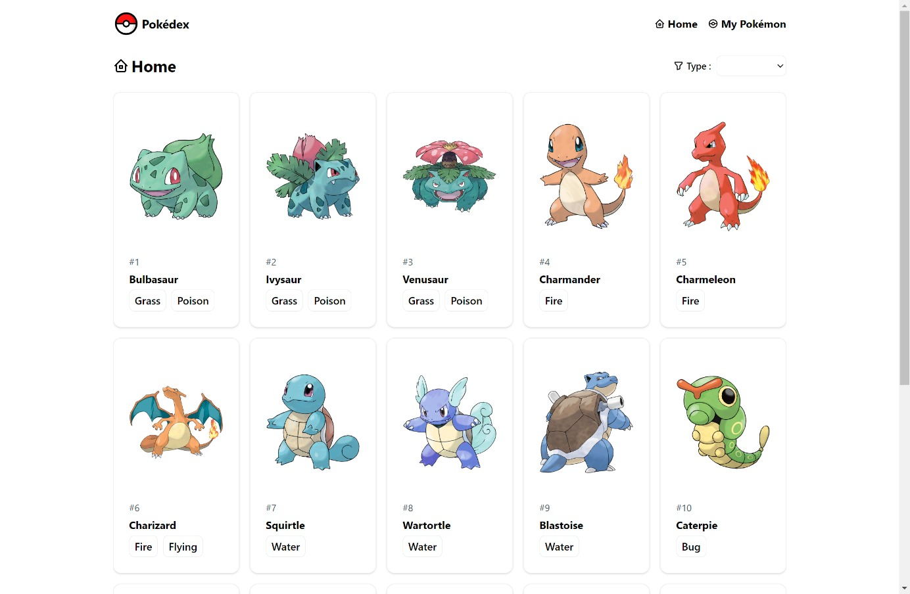
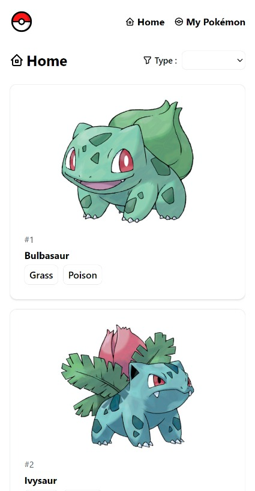
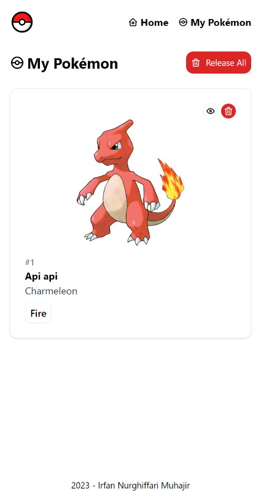

# Pokédex

<p align="center">

</p>

<p align="center">
A simple Pokédex web app built using React & Tailwind CSS
</p>

<div align="center">
<a href="https://pokedex.irfannm.dev">Live demo!</a>
</div>

---


<div align="center">


</div>

### Features

1. List of 150 Pokémon with infinite scrolling
2. Filter Pokémons by their type
3. Display Pokémon details
4. Catch Pokémon to local account 

### Run Locally
### Prerequisites

1. NodeJS & npm installed in your machine
2. Git

### Steps
1. Clone the project

```bash
  git clone https://github.com/irfan44/pokemon
```

2. Go to the project directory

```bash
  cd pokemon
```

3. Install dependencies

```bash
  npm install
```

4. Start the development server

```bash
  npm run dev
```

5. Open http://localhost:5173 with your browser to see the result.

### Built With

1. [Vite](https://vite.dev/) using React template to initialize the project.
2. Written in [Typescript](https://www.typescriptlang.org/)
3. [Tailwind CSS](https://tailwindcss.com/) for building UI
4. [Apollo Client](https://www.apollographql.com/docs/react/) for handling GraphQL request 
5. [React Router](https://reactrouter.com/) for routing 
6. Deployed on [Vercel](https://vercel.com/)

© 2023 Pokémon. © 1995–2023 Nintendo/Creatures Inc./GAME FREAK inc. Pokémon, Pokémon character names, Nintendo Switch, Nintendo 3DS, Nintendo DS, Wii, Wii U, and WiiWare are trademarks of Nintendo.